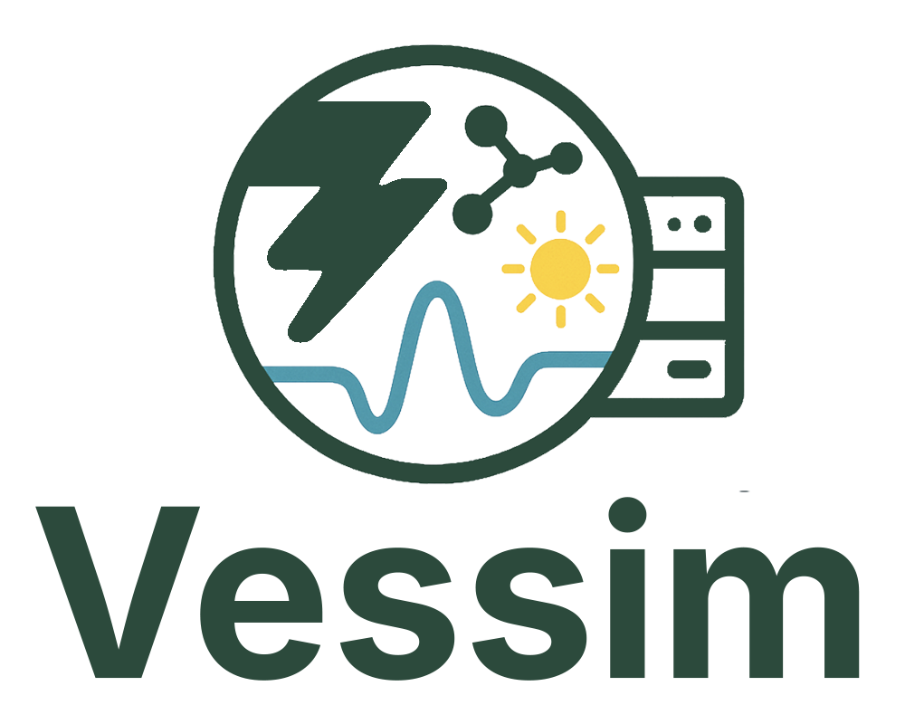

<p align="center">
    
</p>

Vessim is a **co-simulation testbed for computing and energy systems**.

Vessim lets you simulate the interaction of real or simulated computing systems with on-site energy sources, storage, and the public grid.
It connects domain-specific simulators for power generation and batteries with **real software and hardware**.

Check out the [website and documentation](https://vessim.readthedocs.io/en/latest/)!

## What can I do with Vessim?

Vessim helps you to understand and optimize how your (distributed) computing system interacts with (distributed) energy sources and battery storage.

- **Energy-aware and carbon-aware applications**: Develop applications that adapt their energy consumption to the carbon intensity and price of electricity.
- **Microgrid composition**: Experiment with adding solar panels, wind turbines, or batteries to see how they would affect your energy costs and carbon emissions.
- **Demand response and power outages**: Simulate demand response signals or power outages to understand your system's flexibility and test mitigation strategies.

Vessim can simulate multiple distributed microgrids in parallel and easily integrates historical datasets and new simulators. 
Vessim’s software-in-the-loop capabilities let you run real systems against simulated microgrids. Connect live data sources like Prometheus and interact through REST APIs.


## Simple Example

The scenario below simulates a microgrid with a computing system drawing 700W, a solar panel, and a 1.5 kWh battery.

```python
import vessim as vs

environment = vs.Environment(sim_start="2022-06-09", step_size=300)

environment.add_microgrid(
    name="datacenter",
    actors=[
        vs.Actor(name="server", signal=vs.StaticSignal(value=700), consumer=True),
        vs.Actor(name="solar_panel", signal=vs.Trace.from_csv(
            "datasets/solar_example.csv", column="Berlin", scale=5000
        )),
    ],
    dispatchables=[
        vs.SimpleBattery(name="battery", capacity=1500, initial_soc=0.8, min_soc=0.3)
    ],
)

environment.add_controller(vs.CsvLogger("results/my_experiment"))
environment.run(until=24 * 3600)
```

Check out the [Getting Started walkthrough](https://vessim.readthedocs.io/en/latest/getting_started/) and [`examples/`](examples/) for software-in-the-loop simulations.


## Installation

You can install the [latest release](https://pypi.org/project/vessim/) of Vessim
via [pip](https://pip.pypa.io/en/stable/quickstart/):

```
pip install vessim
```

If you require software-in-the-loop capabilities, install the `sil` extension:

```
pip install vessim[sil]
```

## Publications

If you use Vessim in your research, please cite our paper:

- Philipp Wiesner, Ilja Behnke, Paul Kilian, Marvin Steinke, and Odej Kao. "[Vessim: A Testbed for Carbon-Aware Applications and Systems.](https://dl.acm.org/doi/pdf/10.1145/3727200.3727210)" _ACM SIGENERGY Energy Informatics Review 4 (5)_. 2024.

For details in Vessim's software-in-the-loop simulation methodology, refer to:

- Philipp Wiesner, Marvin Steinke, Henrik Nickel, Yazan Kitana, and Odej Kao. "[Software-in-the-Loop Simulation for Developing and Testing Carbon-Aware Applications.](https://doi.org/10.1002/spe.3275)" _Software: Practice and Experience, 53 (12)_. 2023.

For more related papers and concrete use cases, please refer to the [documentation](https://vessim.readthedocs.io/en/latest/publications).
