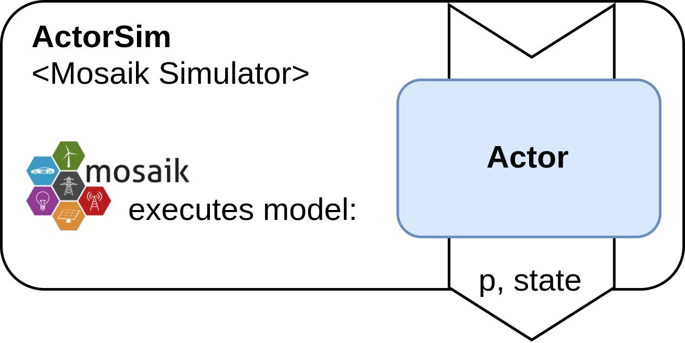
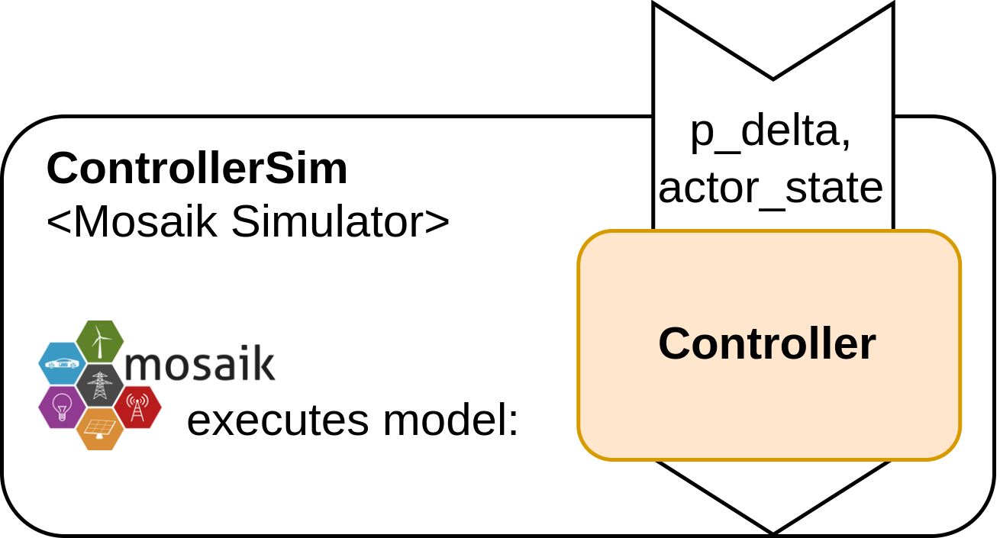
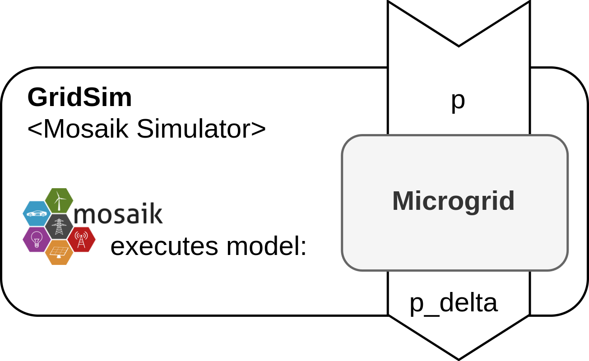
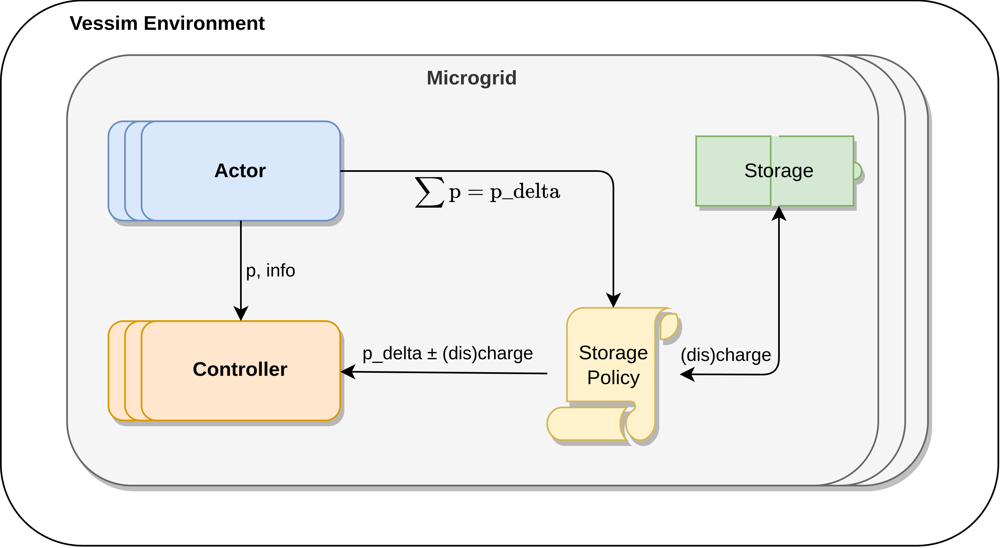

===============
Concepts
===============

The Vessim Cosim interface consists of three base components which include the
Actor, Controller, and Microgrid. Under the hood, each of these components is
mangaged through a mosaik simulator which executes the component as a simulation
model. For you as the user, this mosaik representation only serves as background
information to help you understand how Vessim works.

Actor
=====

The Actor represents an entity that either consumes power (`p < 0`), or produces
power (`p > 0`), which we refer to as power consumers and producers. In a
simulation scenario, this could represent a solar panel or a computing node.

The Actor mosaik model does not receive any input values, but outputs consumed
or produced power `p` and an optional `state` value which can be utilized in a
Controller. All Actors need to be sublcassed from the Actor abstract base class
in `vessim.actor
<https://github.com/dos-group/vessim/blob/main/vessim/actor.py>`_:

.. automodule:: vessim.actor
    :members: Actor
    :noindex:

Controller
==========

The Controller's function involves interacting with the Actors' power and
additional Actor information. Moreover, it engages with the power variance, or
power delta, from the Grid. An example for a Controller could include a load
balancer that, depending on the total power delta, manages the resource
consumption of an Actor.

All Controllers need to be sublcassed from the Controller abstract base class in
`vessim.controller
<https://github.com/dos-group/vessim/blob/main/vessim/controller.py>`_:

.. automodule:: vessim.controller
    :members: Controller
    :noindex:

Microgrid
=========

The Microgrid component serves as the central entity that establishes, connects,
and manages the Actors and Controllers. The Microgrid also performs the
calculation of power delta, based on inputs and storage policies.

The power consumption and production of the Actors is summed to `p_delta` and,
depending on the storage policy, (dis)charged to Storage. The remaining
`p_delta` now either holds excess energy that was not charged to Storage, or a
lack of energy that could not be discharged from Storage. This `p_delta` is then
available to Controllers.

In contrast to the Actor and Controller, the Microgrid is neither to be
subclassed, nor to be instantiated. Instead, the `add_microgrid()` function is
to be used.

.. autofunction:: vessim.cosim.Environment.add_microgrid
    :noindex:
