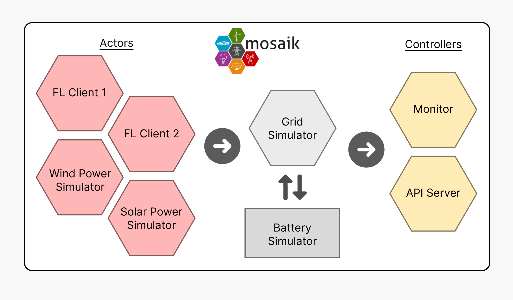

========
Concepts
========

Vessim simulates energy systems by connecting domain-specific simulators for renewable power generation and energy storage through the co-simulation framework `Mosaik
<https://mosaik.offis.de>`_. Mosaik takes care of synchronizing all simulation models and enables message passing between models. *However, to work with Vessim, you do not need to have any knowledge about co-simulation or Mosaik.*

Co-Simulation
=============

A Vessim simulation is represented by a :class:`Environment <vessim.cosim.Environment>` which let's you add an arbitrary number of :class:`Microgrid <vessim.cosim.Microgrid>` simulations. A microgrid models the energy system of a computing system and constitutes the following co-simulation components.

Actors
    Actors are defined by users and model entities that either consume (:math:`p < 0`), or produce (:math:`p > 0`) power.
    Consumers
    Consumers are usually computing systems while producers can represent generators such as solar panels or wind turbines.

Grid
    The grid simulation continually aggregates the current power production/consumption of actors to calculate the power delta :math:`p_{delta}`.

Battery
    The :class:`Storage <vessim.storage.Storage>` simulation can connect domain-specific battery simulators which can (dis)charge based on the current :math:`p_{delta}` based on a :class:`StoragePolicy <vessim.storage.StoragePolicy>`.
    Vessim currently only ships with a :class:`SimpleBattery <vessim.storage.SimpleBattery>`, but we are working on more sophisticated modeling.

Controllers
    :class:`Controllers <vessim.controller.Controller>` are defined by users and can interact with the energy and computing system during execution.
    Vessim currently ships with a :class:`Monitor <vessim.controller.Controller>` which periodically stores the energy system state and can export to CSV.

    We are currently working on better documenting our software-in-the-loop capabilities which let you develop controllers that, for example, expose a REST API that provides applications visibility and control over the energy system.
    Besides getters for current power production, battery state of charge, current grid carbon intensity etc., such controllers can also actively manipulate battery chanre policies or set power modes on computing devices.

For examples, please refer to our tutorials.

Signals
=======

Besides simulating entire energy systems, Vessim also offers a simple utility class for stepping over historical time series, which currently is the most common use case for simulations in carbon-aware computing.

Such time series, represented by a :class:`HistoricalSignal <vessim.signal.HistoricalSignal>`, can, for example, represent grid carbon intensity over time or the power production/consumption of an actor.

For examples, please refer to our tutorials.
