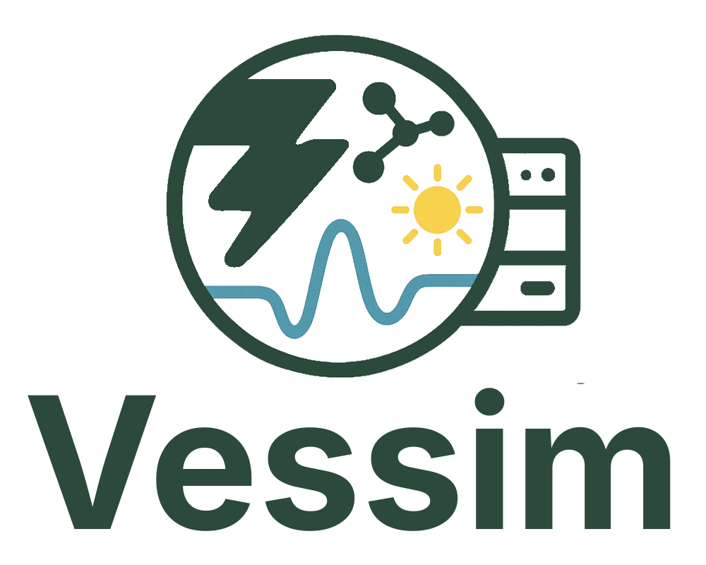
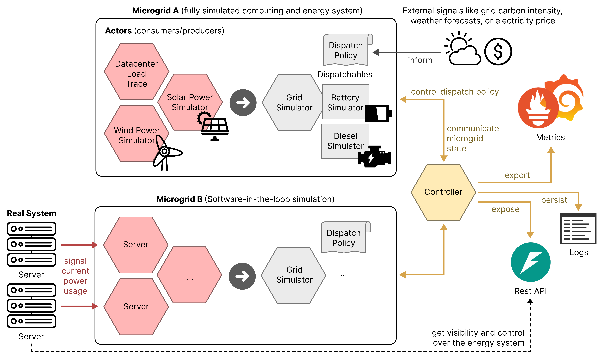

# Overview

Vessim is a **co-simulation testbed for carbon-aware systems** that allows you to simulate how your computing systems interact with local renewable energy sources, battery storage, and the public grid.
It connects domain-specific simulators for power generation and energy storage with **real software and hardware**.

<div style="text-align: center;">
    
</div>

## What can I do with Vessim?

Vessim helps you to understand and optimize how your (distributed) computing system interacts with (distributed) renewable energy sources and battery storage.

- **Carbon-aware applications**: Develop applications that automatically reduce their energy consumption when the grid is powered by fossil fuels, and increase activity when renewable energy is abundant.
- **Energy system composition**: Experiment with adding solar panels, wind turbines, or batteries to see how they would affect your energy costs and carbon emissions.
- **Plan for outages and extreme events**: Simulate power outages or renewable energy fluctuations to understand risks and test backup strategies.
- **Quality assurance**: Apply Vessim in continuous integrating testing to validate software roll-outs in a controlled environment.

Vessim is based on [Mosaik](https://mosaik.offis.de), a general-purpose co-simulation framework.
It can simulate large numbers of microgrids in parallel, comes with ready-to-use datasets, can execute simulated experiments faster than real-time, and is easily extendable with new simulators of any platform through Mosaik's TCP interface.
You can **connect Vessim to real-world applications and hardware**, enabling software-in-the-loop (SiL) testing.

## Installation

You can install our [latest release](https://pypi.org/project/vessim/) via [pip](https://pip.pypa.io/en/stable/getting-started/):

```console
pip install vessim
```

If you require software-in-the-loop capabilities (e.g. loading live data from Prometheus and/or exposing the simulated microgrids via a REST API), you can install the `sil` extra:

```console
pip install vessim[sil]
```


## How Vessim Works

Vessim can simulate local energy systems (we call them "microgrids") that combine computing equipment with renewable energy sources and batteries.



In the diagram, all hexagons represent a distinct [Mosaik](https://mosaik.offis.de) component which can be either simulated or real (software-in-the-loop).
Vessim has the following core components:

- **Actors** (red): Energy consumers and producers
    - Computing systems (servers, workstations, etc.) that consume power
    - Renewable sources (solar panels, wind turbines) that produce power
    - Both can be based on other simulators, historical traces, or real-life input from power meters

- **Energy Storage** (gray): From batteries to hydrogen storage
    - Batteries that store excess renewable energy for later use
    - Vessim already implements analytical models for realistic Li-ion battery modeling
    - Configurable charging/discharging policies based on your strategy

- **Controller** (yellow): Enable logging, monitoring, REST APIs, and custom control strategies
    - Loggers can track the energy system state and carbon emissions over time in memory or, e.g., in a CSV file
    - REST APIs can provide real-time visibility and control over the simulated energy system
    - You can implement custom control strategies to e.g. schedule computing workloads based on energy availability
