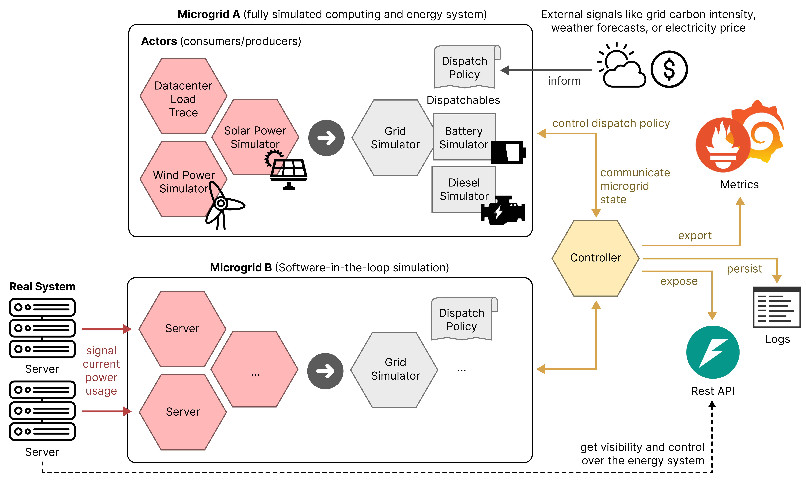

#

<div style="text-align: center; margin-top: -50px">
    
</div>

Vessim is a **co-simulation testbed for computing and energy systems**.

Vessim lets you simulate the interaction of real or simulated computing systems with on-site energy sources, storage, and the public grid.
It connects domain-specific simulators for power generation and batteries with real software and hardware.


## What can I do with Vessim?

Vessim helps you to understand and optimize how your (distributed) computing system interacts with (distributed) energy sources and battery storage.

- **Energy-aware and carbon-aware applications**: Develop applications that adapt their energy consumption to the carbon intensity and price of electricity.
- **Microgrid composition**: Experiment with adding solar panels, wind turbines, or batteries to see how they would affect your energy costs and carbon emissions.
- **Demand response and power outages**: Simulate demand response signals or power outages to understand your system's flexibility and test mitigation strategies.

Vessim can simulate multiple distributed microgrids in parallel and easily integrates historical datasets and new simulators.

Vessim's [software-in-the-loop](concepts/sil.md) capabilities let you run real systems against simulated microgrids. Connect live data sources like Prometheus and interact through REST APIs.


## How Vessim Works

Vessim simulates local energy systems, called **microgrids**, that combine computing equipment with (renewable) energy sources, dispatchable resources like batteries, and a connection to the public grid.



Vessim is built on [Mosaik](https://mosaik.offis.de), a general-purpose co-simulation framework.
Each hexagon in the diagram is a Mosaik component that can be simulated or run as real software (software-in-the-loop).
A microgrid is composed of three kinds of building blocks:

- **[Actors](concepts/signals.md)** (red): exogenous consumers and producers — servers, solar panels, wind turbines — whose power is determined by a `Signal`. Their sum at each step is the microgrid's *power delta*.
- **[Dispatchables](concepts/dispatchables.md)** (gray): controllable resources like batteries or generators. A `DispatchPolicy` decides how to distribute the power delta across them; any remainder is exchanged with the public grid.
- **[Controllers](concepts/controllers.md)** (yellow): observe the simulation each step. Built-in loggers record the state, and custom controllers can adjust dispatch parameters or expose the simulation via REST.


## Try it now

Head to [Getting Started](getting_started.md) for a step-by-step walkthrough that builds a complete microgrid in a few lines of code.

You can also explore a finished simulation in your browser — [open the **Experiment Viewer**](viewer/index.html){target="_blank"} to see the interactive dashboard for the Getting Started run.


## Installation

Install the [latest release](https://pypi.org/project/vessim/) via [pip](https://pip.pypa.io/en/stable/getting-started/):

```console
pip install vessim
```

For software-in-the-loop capabilities (loading live data from Prometheus, exposing the simulated microgrid via a REST API), install the `sil` extra:

```console
pip install vessim[sil]
```


## Contact

Please reach out via [GitHub Discussions](https://github.com/dos-group/vessim/discussions) in case of questions.
