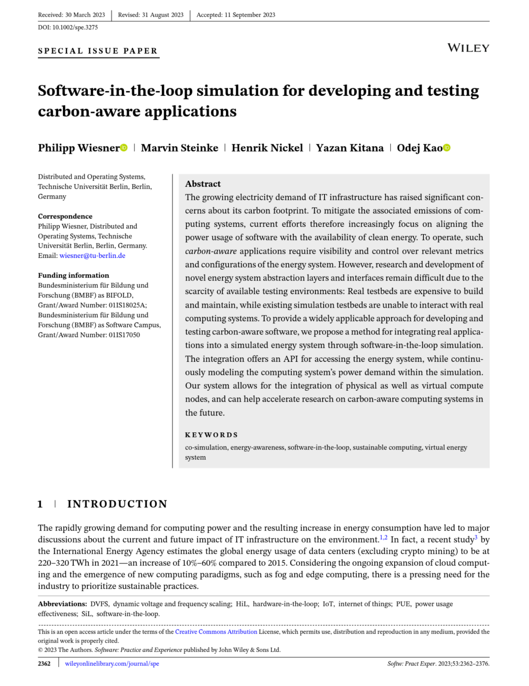

==================================
Welcome to Vessim's Documentation!
==================================

Vessim is a versatile **co-simulation testbed for carbon-aware applications and
systems**. It lets users connect domain-specific simulators for energy system
components such as renewable power generation and energy storage with *real*
software and hardware while abstracting microgrid complexities.

Vessim is based on |mosaik| , a general-purpose co-simulation framework.

.. |mosaik| image:: _static/mosaik.png
    :height: 3 em
    :target: https://mosaik.offis.de 

.. image:: _static/CarbonAware_vessim_Aspects.png
    :width: 75%
    :align: center

This documentation guides you through the concepts of Vessim, presents usage
tutorials to get you started, and provides the API reference.

.. note::
    
    Vessim is in alpha stage and under active development. Functionality and
    documentation will improve in the next weeks and months.

What can I do with it?
======================

    - **Carbon-aware applications**: Vessim allows rapid prototyping of carbon-aware computing ideas, offering access to current standards and promoting common dataset use.
    - **Energy system composition**: Examine how integrating components like solar panels affects computing systems and evaluate requirements for energy-autonomous data centers.
    - **Digital Twin**: Predict future system states in carbon-aware datacenters, aid decision-making, and assess risks during extreme events like power outages.
    - **Quality Assurance**: Apply Vessim in continuous integrating testing or use it to validate software roll-outs in a controlled environment.

Further Reading & Research
==========================

If you'd like to dive deeper into the base concepts of this project, you can
read more in our our vision paper, `"A Testbed for Carbon-Aware Applications and
Systems" <https://arxiv.org/pdf/2306.09774.pdf>`_ or our journal paper on
software-in-the-loop simulation for carbon-aware applications,
`"Software-in-the-Loop Simulation for Developing and Testing Carbon-Aware
Applications" <https://onlinelibrary.wiley.com/doi/10.1002/spe.3275>`_.

.. |pic1| image:: _static/vessim_paper.png
   :width: 49%

.. centered:: |pic1| |pic2|

If you use Vessim in your research, please cite either one:

.. code-block:: text

    @misc{wiesner2023vessim,
        title={A Testbed for Carbon-Aware Applications and Systems}, 
        author={Wiesner, Philipp and Behnke, Ilja and Kao, Odej},
        year={2023},
        eprint={2306.09774},
        archivePrefix={arXiv},
        primaryClass={cs.DC}
    }

.. code-block:: text

    @article{wiesner2023sil,
        title = {Software-in-the-loop simulation for developing and testing carbon-aware applications},
        author = {Wiesner, Philipp and Steinke, Marvin and Nickel, Henrik and Kitana, Yazan and Kao, Odej},
        journal = {Software: Practice and Experience},
        year = {2023},
        volume = {53},
        number = {12},
        pages = {2362-2376},
        doi = {https://doi.org/10.1002/spe.3275}
    }

.. toctree::
    :maxdepth: 3
    :hidden:
    :caption: Content:

    Overview <self>
    main_components/index
    installation/index
    tutorials/index
    api_reference/index
    about_vessim/index