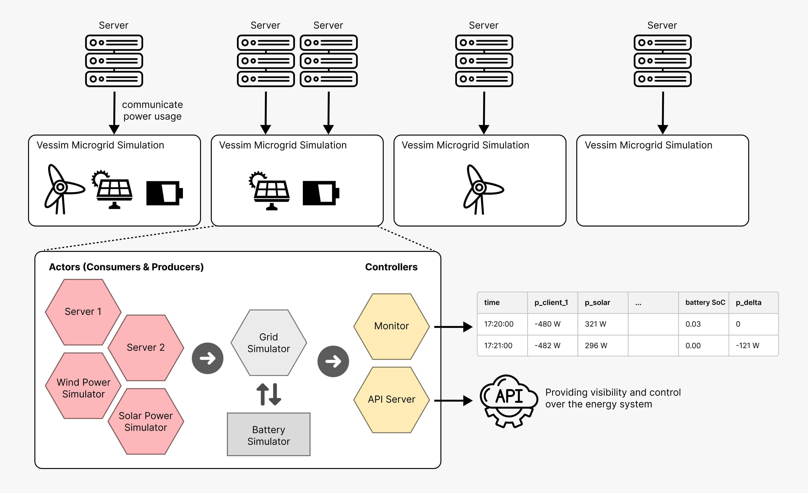

======
Vessim
======

Vessim is a **co-simulation testbed for carbon-aware systems** that allows you to simulate how your computing systems interact with local renewable energy sources, battery storage, and the public grid.
It connects domain-specific simulators for power generation and energy storage with **real software and hardware**.

What can I do with Vessim?
==========================

Vessim helps you to understand and optimize how your (distributed) computing system interacts with (distributed) renewable energy sources and battery storage.

    - **Carbon-aware applications**: Develop applications that automatically reduce their energy consumption when the grid is powered by fossil fuels, and increase activity when renewable energy is abundant.
    - **Energy system composition**: Experiment with adding solar panels, wind turbines, or batteries to see how they would affect your energy costs and carbon emissions.
    - **Plan for outages and extreme events**: Simulate power outages or renewable energy fluctuations to understand risks and test backup strategies.
    - **Quality assurance**: Apply Vessim in continuous integrating testing to validate software roll-outs in a controlled environment.

Vessim is based on `Mosaik <https://mosaik.offis.de>`_, a general-purpose co-simulation framework.
It can simulate large numbers of microgrids in parallel, comes with ready-to-use datasets, can execute simulated experiments faster than real-time, and is easily extendable with new simulators of any platform through Mosaik's TCP interface.
You can **connect Vessim to real-world applications and hardware**, enabling software-in-the-loop (SiL) testing.

Installation
============

You can install our `latest release <https://pypi.org/project/vessim/>`_ via
`pip <https://pip.pypa.io/en/stable/getting-started/>`_:

.. code-block:: console

    pip install vessim

If you require software-in-the-loop (SiL) capabilities, you can install the
`sil`` extra:

.. code-block:: console

    pip install vessim[sil]

For complex scenarios that involve custom co-simulation actors we recommend
cloning and editing this depository directly.

How Vessim Works
================

Vessim creates simulated "microgrids" - small energy systems that combine computing equipment with renewable energy sources and batteries.

It has the following core components:

- **Actors**: Energy consumers and producers
    - Computing systems (servers, workstations, etc.) that consume power
    - Renewable sources (solar panels, wind turbines) that produce power
    - Both can be based on other simulators, historical traces, or real-life input from power meters

- **Energy Storage**: From batteries to hydrogen storage
    - Batteries that store excess renewable energy for later use
    - Vessim already implements analytical models for realistic Li-ion battery modeling
    - Configurable charging/discharging policies based on your strategy

- **Controllers**: Enable monitoring, REST APIs, and custom control strategies
    - Monitors can track the energy system state and carbon emissions over time in a CSV file
    - REST APIs can provide real-time visibility and control over the simulated energy system
    - You can implement custom control strategies to e.g. schedule computing workloads based on energy availability

.. toctree::
    :maxdepth: 3
    :hidden:
    :caption: Content:

    Overview <self>
    tutorials/index
    api_reference/index
    about