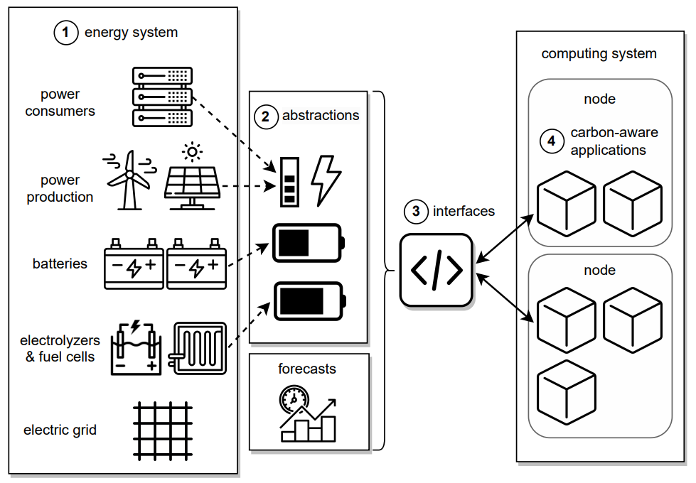

Overview
==========

Vessim is a versatile **co-simulation testbed for carbon-aware applications and systems**.
It lets users connect domain-specific simulators for energy system components like renewable power generation, 
energy storage, and power flow analysis with real software and hardware.

The documentation provides a guide explaining the concept of this project, two examples to get you started with it and an API reference.

Vessim is released under the `MIT License <https://github.com/dos-group/vessim/blob/main/LICENSE>`_. 

.. toctree::
   :maxdepth: 4
   :hidden:

   concept
   installation